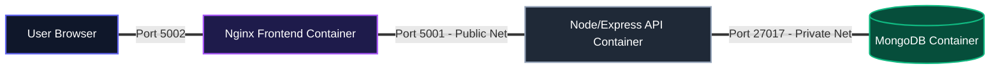

# QuoteScape: 3-Tier MERN Architecture Deployment & Containerization

**A DevOps Portfolio Project by Wasif ur Rehman**

QuoteScape is a modern, full-stack three-tier application built using the MERN stack (MongoDB, Express.js, React.js, and Node.js). This repository serves as a comprehensive DevOps case study, documenting the lifecycle of the application as it migrates from a manually provisioned Linux environment to a fully containerized, microservices-based deployment.

---

## System Architecture & Network Isolation

The architecture is split into three decoupled components, utilizing bridge networking to segregate databases from the public presentation layer:

1.  **Frontend Client**: React.js SPA initialized using Vite, packaged and served efficiently via Nginx.
2.  **API Gateway**: Node.js and Express.js backend acting as the server logic layer.
3.  **Database Engine**: MongoDB database instance acting as the state/persistence layer.



### Network Topology Security
To implement strict service isolation:
*   `frontend-backend-net`: Connects the browser client's Nginx router with the Node.js API container.
*   `backend-db-net`: Connects the API gateway to the database. The MongoDB instance is entirely isolated from the frontend and external traffic.

---

## Core DevOps Concepts Demonstrated

*   **Production Image Size Optimization**: Leveraged multi-stage Docker builds for the React application to exclude node node_modules from the final image, drastically reducing storage foot-print.
*   **Startup Verification & Dependency Control**: Orchestrated Docker Compose services with explicit health checks (`mongosh --eval` and Node `fetch` status checks) to ensure sequential, error-free container initialization.
*   **Persistent Storage Configuration**: Utilized named storage volumes for database container lifecycles, ensuring zero loss of persistent data when containers are stopped or rebuilt.

---

## Phase 1: Manual VM Deployment Walkthrough
Below is the deployment log representing how this application is manually set up on a Linux/Ubuntu virtual machine.

### 1. Preparing the Database (MongoDB)
*   Install MongoDB and ensure the daemon is running:
    ```bash
    sudo apt install -y mongodb
    sudo systemctl start mongodb
    ```
*   Initialize and populate the quotes collection:
    ```bash
    mongo
    > use quotesdb;
    > db.quotes.insertMany([
        { quote: "Be the change you want to see in the world.", author: "Ghandi" },
        { quote: "Master patterns in life, and you'll never suffer is the secret.", author: "someone" }
      ]);
    ```

### 2. Launching the Backend API
*   Install Node.js (v22+) and configure the global process manager PM2:
    ```bash
    curl -fsSL https://deb.nodesource.com/setup_22.x | sudo -E bash -
    sudo apt install -y nodejs
    sudo npm install -g pm2
    ```
*   Set up variables and launch:
    ```bash
    cd api/
    npm install --omit=dev
    export MONGO_URI="mongodb://localhost:27017/quotesdb"
    pm2 start server.js --name "quotes-api"
    ```

### 3. Deploying the Front-End Client
*   Install Nginx:
    ```bash
    sudo apt install nginx -y
    ```
*   Build React production assets:
    ```bash
    cd ../app/
    npm install
    npm run build
    ```
*   Update the Nginx default config to point to `/app/dist` and forward API routes:
    ```nginx
    server {
        listen 5002;
        location / {
            root /var/www/quotescape/dist;
            try_files $uri /index.html;
        }
        location /api/ {
            proxy_pass http://localhost:5001;
        }
    }
    ```
*   Reload Nginx:
    ```bash
    sudo systemctl restart nginx
    ```

---

## Phase 2: Automated Orchestration (Docker Compose)

### 1. Build and Run the Stack
Run this single command to spin up the isolated presentation, application, and database containers automatically:
```bash
docker compose up --build -d
```

### 2. Verify Deployments
*   **Web Portal**: [http://localhost:5002](http://localhost:5002)
*   **API Service**: [http://localhost:5001/api/quotes](http://localhost:5001/api/quotes)
*   **System Health**: [http://localhost:5001/health](http://localhost:5001/health)

### 3. Tear Down Options
*   Stop containers without losing data:
    ```bash
    docker compose down
    ```
*   Clean all containers and reset database records:
    ```bash
    docker compose down -v
    ```

---

## Environment Variable Schema

| Variable Name | Applied To | Target Endpoint | Description |
| :--- | :--- | :--- | :--- |
| `PORT` | `backend` | `5001` | Express listener port |
| `MONGO_URI` | `backend` | `mongodb://db:27017/quotesdb` | Mongoose Connection String |
| `MONGO_INITDB_DATABASE` | `db` | `quotesdb` | MongoDB Database Name |
