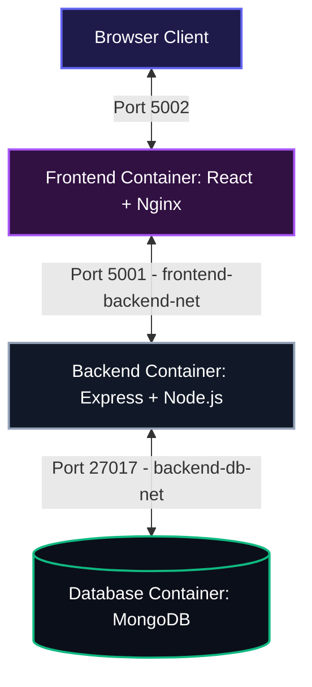

# 3-Tier MERN Application: Manual to Containerized Deployment

A DevOps portfolio project demonstrating the migration of a multi-tier MERN (MongoDB, Express.js, React.js, Node.js) web application from a manually provisioned Linux environment to a fully containerized architecture using Docker and Docker Compose.

---

## Architecture Overview

This application consists of three decoupled layers:
1.  **Frontend (Presentation Layer)**: A React application built with Vite and served via an optimized Nginx server.
2.  **Backend (Logic Layer)**: A Node.js and Express.js REST API that handles business logic and acts as the gateway to the data layer.
3.  **Database (Data Layer)**: A MongoDB database storing persistent application data.

### Isolated Networks (Network Bridges)
To maintain security best practices, the database is placed on an isolated network (`backend-db-net`) where it is only reachable by the API server. The React client and API server communicate over a public-facing network (`frontend-backend-net`).



---

## Highlights & DevOps Core Concepts

*   **Manual Deployment Lifecycle**: Simulates bare-metal or VM provisioning (packages installation, environment configuration, database seeding, process management using PM2, Nginx routing).
*   **Multi-Stage Docker Builds**: Frontend Dockerfile utilizes a multi-stage approach (compiling assets with Node.js and copying the static artifacts to Nginx) to keep the final container image size minimal.
*   **Deterministic Orchestration**: Docker Compose configures service dependencies using `depends_on` alongside custom `healthcheck` scripts, ensuring MongoDB is active before Express starts, and Express is active before Nginx boots.
*   **Data Persistence**: Uses named Docker volumes (`mongodb_data`) to prevent data loss across container teardowns.

---

## 1. Manual Deployment Guide (VM / Linux)
To understand the containerization benefit, this guide details how the application was manually provisioned on a Linux system.

### Step 1: Database Provisioning
1. Install MongoDB on your Linux server:
   ```bash
   sudo apt-get install -y mongodb-org
   sudo systemctl enable --now mongod
   ```
2. Connect to the database shell and seed the initial quotes collection:
   ```javascript
   use quotesdb;
   db.quotes.insertMany([
     { quote: "Be the change you want to see in the world.", author: "Ghandi" },
     { quote: "Master patterns in life, and you'll never suffer is the secret.", author: "someone" }
   ]);
   ```

### Step 2: Backend API Setup
1. Install Node.js runtime and PM2 process manager:
   ```bash
   curl -fsSL https://deb.nodesource.com/setup_22.x | sudo -E bash -
   sudo apt-get install -y nodejs
   sudo npm install -g pm2
   ```
2. Clone the directory, navigate to `api/`, install production dependencies, and launch with PM2:
   ```bash
   cd api/
   npm install --omit=dev
   export MONGO_URI="mongodb://localhost:27017/quotesdb"
   pm2 start server.js --name "quotes-api"
   ```

### Step 3: Frontend Deployment
1. Build React static files:
   ```bash
   cd ../app/
   npm install
   npm run build
   ```
2. Install Nginx and configure a server block to serve `/app/dist` and proxy API calls:
   ```bash
   sudo apt-get install -y nginx
   ```
   Configure `/etc/nginx/sites-available/default`:
   ```nginx
   server {
       listen 5002;
       root /path/to/app/dist;
       index index.html;

       location / {
           try_files $uri $uri/ /index.html;
       }

       location /api/ {
           proxy_pass http://localhost:5001;
       }
   }
   ```
3. Restart Nginx:
   ```bash
   sudo systemctl restart nginx
   ```

---

## 2. Containerized Deployment Guide (Docker Compose)
This is the modern, automated approach where the entire infrastructure is managed as code.

### Prerequisites
*   Docker installed and running.
*   Docker Compose installed.

### Steps to Run
1.  **Build the Container Images**:
    ```bash
    docker compose build
    ```
2.  **Start the Application Stack**:
    ```bash
    docker compose up -d
    ```
    *This command starts all containers in detched mode. The startup order is MongoDB ➔ Express API ➔ React Nginx, enforced by healthchecks.*

3.  **Access the Application**:
    *   **Frontend Client**: [http://localhost:5002](http://localhost:5002)
    *   **Backend API**: [http://localhost:5001/api/quotes](http://localhost:5001/api/quotes)
    *   **Backend Health Check**: [http://localhost:5001/health](http://localhost:5001/health)

4.  **Tear Down the Stack**:
    To stop the application while keeping data intact:
    ```bash
    docker compose down
    ```
    To stop the application and wipe the persistent database volume:
    ```bash
    docker compose down -v
    ```

---

## Environment Configuration

The containers are configured using the following environment variables (defined inside `docker-compose.yml`):

| Variable | Service | Default Value | Description |
| :--- | :--- | :--- | :--- |
| `PORT` | `backend` | `5001` | The network port the API server listens on. |
| `MONGO_URI` | `backend` | `mongodb://db:27017/quotesdb` | MongoDB connection string. |
| `MONGO_INITDB_DATABASE` | `db` | `quotesdb` | Seeds the name of the database to create inside MongoDB. |

---

## Logs and Troubleshooting

*   **View Logs for All Services**:
    ```bash
    docker compose logs -f
    ```
*   **View Logs for the Backend API Only**:
    ```bash
    docker compose logs -f backend
    ```
*   **Check Service Statuses**:
    ```bash
    docker compose ps
    ```
